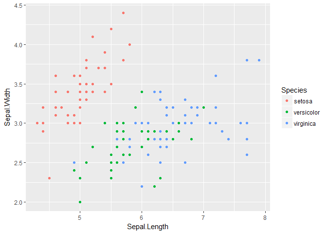
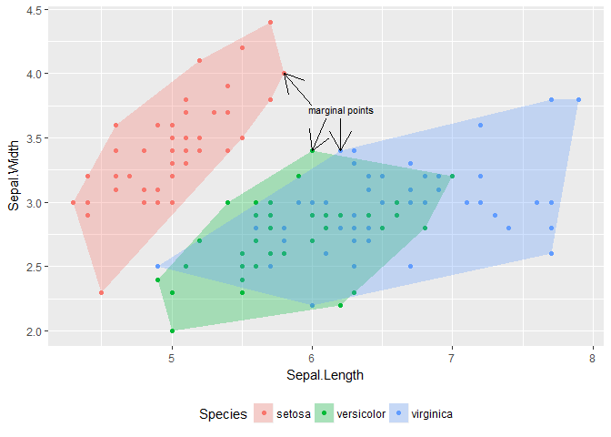
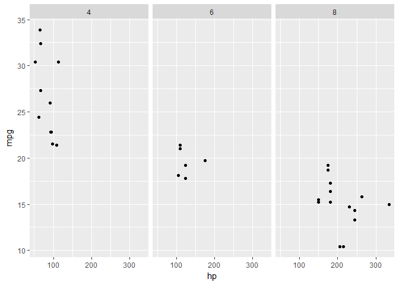
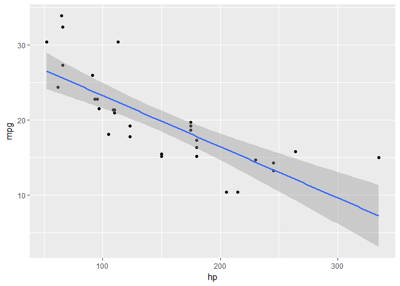

# Data Science Examples and Problems
## Overview
This is an [R Markdown](http://rmarkdown.rstudio.com) Notebook. When you execute code within the notebook, the results appear beneath the code. 

The purpose of this notebook is provide some examples and problems for students to explore the use of R in analyzing data. For this set of problems, we use the built-in dataset called 'iris', based on Ronald Fischer's 1936 pioneering work on statistics in biology. It is a multivariate data set introduced in his paper, "The use of multiple measurements in taxonomic problems."

Because it is included in the R distribution, you can get immediate help by entering:

?iris

he ? is a general purpose tool for command-line help.

Here is an illustration of the iris attributes.


If you want to explore other included datasets, type

library(help = "datasets")

This will give you a list of all included datasets in the dataset library for R.

Nice! we have inline help which describes our dataset. This is available for all included datasets.

Add a new chunk by clicking the *Insert Chunk* button on the toolbar or by pressing *Ctrl+Alt+I*.

When you save the notebook, an HTML file containing the code and output will be saved alongside it (click the *Preview* button or press *Ctrl+Shift+K* to preview the HTML file).

First some information about the dataset. 

* The dim() function tells the dimension of the dataset
* The summary tells us something about structure
* Str() function gives is more information


```r
dim(iris)
```

```
## [1] 150   5
```

```r
summary(iris)
```

```
##   Sepal.Length    Sepal.Width     Petal.Length    Petal.Width   
##  Min.   :4.300   Min.   :2.000   Min.   :1.000   Min.   :0.100  
##  1st Qu.:5.100   1st Qu.:2.800   1st Qu.:1.600   1st Qu.:0.300  
##  Median :5.800   Median :3.000   Median :4.350   Median :1.300  
##  Mean   :5.843   Mean   :3.057   Mean   :3.758   Mean   :1.199  
##  3rd Qu.:6.400   3rd Qu.:3.300   3rd Qu.:5.100   3rd Qu.:1.800  
##  Max.   :7.900   Max.   :4.400   Max.   :6.900   Max.   :2.500  
##        Species  
##  setosa    :50  
##  versicolor:50  
##  virginica :50  
##                 
##                 
## 
```

```r
str(iris)
```

```
## 'data.frame':	150 obs. of  5 variables:
##  $ Sepal.Length: num  5.1 4.9 4.7 4.6 5 5.4 4.6 5 4.4 4.9 ...
##  $ Sepal.Width : num  3.5 3 3.2 3.1 3.6 3.9 3.4 3.4 2.9 3.1 ...
##  $ Petal.Length: num  1.4 1.4 1.3 1.5 1.4 1.7 1.4 1.5 1.4 1.5 ...
##  $ Petal.Width : num  0.2 0.2 0.2 0.2 0.2 0.4 0.3 0.2 0.2 0.1 ...
##  $ Species     : Factor w/ 3 levels "setosa","versicolor",..: 1 1 1 1 1 1 1 1 1 1 ...
```


Here is a quick look at the data graphically. It demonstrates both the built-in plot function and the ggplot library.

Note that the ggplot shows each species in a different color, so that plot provides more information.

<!-- --><!-- -->

The next plot shows regions of each species. Thanks to Yu Yang Liu for this code on Kaggle. https://www.kaggle.com/c34klh123/iris-data-with-ggplot-shiny/code

The object convexHull is a function that computes the regions. It is called generating the iris2 dataframe.

Note:  The "marginal points" are "NOT in the region".  They are "just outside the region"

```r
convexHull<-function(df) df[chull(df$Sepal.Length,df$Sepal.Width),]
  
iris2<-plyr::ddply(iris,"Species",convexHull)
ggplot(iris,aes(Sepal.Length,Sepal.Width))+
    geom_point(data=iris,aes(color=Species))+
    geom_polygon(data=iris2,alpha=.3,aes(Sepal.Length,Sepal.Width,fill=Species))+
    theme(legend.position = "bottom",plot.title = element_text(size = 15,hjust = 0.5))+
  annotate("segment",x=6,xend=5.8,y=3.75,yend =4 ,arrow=arrow(),color="black")+
  annotate("segment",x=6.2,xend=6.2,y=3.65,yend =3.4 ,arrow=arrow(),color="black")+
  annotate("segment",x=6.1,xend=6,y=3.65,yend =3.4 ,arrow=arrow(),color="black")+
  annotate("text",x=6.21,y=3.72,label="marginal points",color="black",size=3)
```

<!-- -->

### Problem Set

It is your turn now. You should fill in each section with R code to answer the question.

#### What is are the overall mean for each attribute of the 3 species?

Hint: try using the dplyr library operators like group_by, summarize, and %>% (pipe).


```r
library(dplyr)
```

```
## 
## Attaching package: 'dplyr'
```

```
## The following objects are masked from 'package:stats':
## 
##     filter, lag
```

```
## The following objects are masked from 'package:base':
## 
##     intersect, setdiff, setequal, union
```

```r
#Start with this:

iris %>%
    group_by(Species)
```

```
## # A tibble: 150 x 5
## # Groups:   Species [3]
##    Sepal.Length Sepal.Width Petal.Length Petal.Width Species
##           <dbl>       <dbl>        <dbl>       <dbl>  <fctr>
##  1          5.1         3.5          1.4         0.2  setosa
##  2          4.9         3.0          1.4         0.2  setosa
##  3          4.7         3.2          1.3         0.2  setosa
##  4          4.6         3.1          1.5         0.2  setosa
##  5          5.0         3.6          1.4         0.2  setosa
##  6          5.4         3.9          1.7         0.4  setosa
##  7          4.6         3.4          1.4         0.3  setosa
##  8          5.0         3.4          1.5         0.2  setosa
##  9          4.4         2.9          1.4         0.2  setosa
## 10          4.9         3.1          1.5         0.1  setosa
## # ... with 140 more rows
```

```r
#
#   add summarize here
```


#### Plot points for each of the three species of Sepal.length vs. Sepal.Wide and Petal.Length vs. Petal.Width. 

This should produce 6 graphs which look something like the ggplot below that I created using the mtcars dataset. First the built-in plot function, which simply plots mpg vs hp:


```r
plot(x = mtcars$hp, y = mtcars$mpg,main="Miles per gallon vs. horsepower",xlab="Horsepower",ylab = "Miles per Gallon")
```

<!-- -->

Here are similar plots using ggplot which demonstrates three side-by-side graphs with the same x and y axes:

```r
ggplot (mtcars,aes(x=hp,y=mpg)) + geom_point() + facet_wrap (~cyl,nrow=1)
```

<!-- -->

Try using ggplot and place the graphs 3 accross and two down, with Sepal in the upper set of graphs and petal in the lower.


```r
# Put the code for your plot here.
```

#### Add linear regression line 

Now with one of the ggplot renderings, add a linear regression line to the plot. For example:


```r
#  (by default includes 95% confidence region)

ggplot (mtcars,aes(x=hp,y=mpg)) + geom_point() + geom_smooth(method=lm)   
```

<!-- -->

Add the linear regression line, with the confidence interval.


```r
# Your code goes here:
```


#### Use the gather function from the tidyr library to compute mean and standard deviations without having to explicitly name each of the length and width columns. Try writing this as one R statement.


Here is a pointer to dplyr and tidyr:

https://rpubs.com/bradleyboehmke/data_wrangling


```r
# Your code goes here:
```


#### Explore the use of 3 dimensional plotting with the plotly library. Use the plot_ly function. Plot the dimensions on the x,y, and z coordinates and the species with colors.

Here is an example:

```r
library(plotly)
```

```
## 
## Attaching package: 'plotly'
```

```
## The following object is masked from 'package:ggplot2':
## 
##     last_plot
```

```
## The following object is masked from 'package:stats':
## 
##     filter
```

```
## The following object is masked from 'package:graphics':
## 
##     layout
```

```r
mtcars$am[which(mtcars$am == 0)] = 'Automatic'
mtcars$am[which(mtcars$am == 1)] = 'Manual'
mtcars$am = as.factor(mtcars$am)

p = plot_ly(mtcars, x = ~wt, y = ~hp, z = ~qsec, color = ~am, 
            colors = c('#BF382A', '#0C4B8E')) %>%
            add_markers() %>%
            layout(scene = list(xaxis = list(title = 'Weight'),
                     yaxis = list(title = 'Gross horsepower'),
                     zaxis = list(title = '1/4 mile time')))
p
```

<!--html_preserve--><div id="2a601c086f30" style="width:672px;height:480px;" class="plotly html-widget"></div>
<script type="application/json" data-for="2a601c086f30">{"x":{"visdat":{"2a60796324":["function () ","plotlyVisDat"]},"cur_data":"2a60796324","attrs":{"2a60796324":{"x":{},"y":{},"z":{},"color":{},"colors":["#BF382A","#0C4B8E"],"alpha":1,"sizes":[10,100],"type":"scatter3d","mode":"markers"}},"layout":{"margin":{"b":40,"l":60,"t":25,"r":10},"scene":{"xaxis":{"title":"Weight"},"yaxis":{"title":"Gross horsepower"},"zaxis":{"title":"1/4 mile time"}},"xaxis":{"domain":[0,1]},"yaxis":{"domain":[0,1]},"hovermode":"closest","showlegend":true},"source":"A","config":{"modeBarButtonsToAdd":[{"name":"Collaborate","icon":{"width":1000,"ascent":500,"descent":-50,"path":"M487 375c7-10 9-23 5-36l-79-259c-3-12-11-23-22-31-11-8-22-12-35-12l-263 0c-15 0-29 5-43 15-13 10-23 23-28 37-5 13-5 25-1 37 0 0 0 3 1 7 1 5 1 8 1 11 0 2 0 4-1 6 0 3-1 5-1 6 1 2 2 4 3 6 1 2 2 4 4 6 2 3 4 5 5 7 5 7 9 16 13 26 4 10 7 19 9 26 0 2 0 5 0 9-1 4-1 6 0 8 0 2 2 5 4 8 3 3 5 5 5 7 4 6 8 15 12 26 4 11 7 19 7 26 1 1 0 4 0 9-1 4-1 7 0 8 1 2 3 5 6 8 4 4 6 6 6 7 4 5 8 13 13 24 4 11 7 20 7 28 1 1 0 4 0 7-1 3-1 6-1 7 0 2 1 4 3 6 1 1 3 4 5 6 2 3 3 5 5 6 1 2 3 5 4 9 2 3 3 7 5 10 1 3 2 6 4 10 2 4 4 7 6 9 2 3 4 5 7 7 3 2 7 3 11 3 3 0 8 0 13-1l0-1c7 2 12 2 14 2l218 0c14 0 25-5 32-16 8-10 10-23 6-37l-79-259c-7-22-13-37-20-43-7-7-19-10-37-10l-248 0c-5 0-9-2-11-5-2-3-2-7 0-12 4-13 18-20 41-20l264 0c5 0 10 2 16 5 5 3 8 6 10 11l85 282c2 5 2 10 2 17 7-3 13-7 17-13z m-304 0c-1-3-1-5 0-7 1-1 3-2 6-2l174 0c2 0 4 1 7 2 2 2 4 4 5 7l6 18c0 3 0 5-1 7-1 1-3 2-6 2l-173 0c-3 0-5-1-8-2-2-2-4-4-4-7z m-24-73c-1-3-1-5 0-7 2-2 3-2 6-2l174 0c2 0 5 0 7 2 3 2 4 4 5 7l6 18c1 2 0 5-1 6-1 2-3 3-5 3l-174 0c-3 0-5-1-7-3-3-1-4-4-5-6z"},"click":"function(gd) { \n        // is this being viewed in RStudio?\n        if (location.search == '?viewer_pane=1') {\n          alert('To learn about plotly for collaboration, visit:\\n https://cpsievert.github.io/plotly_book/plot-ly-for-collaboration.html');\n        } else {\n          window.open('https://cpsievert.github.io/plotly_book/plot-ly-for-collaboration.html', '_blank');\n        }\n      }"}],"cloud":false},"data":[{"x":[3.215,3.44,3.46,3.57,3.19,3.15,3.44,3.44,4.07,3.73,3.78,5.25,5.424,5.345,2.465,3.52,3.435,3.84,3.845],"y":[110,175,105,245,62,95,123,123,180,180,180,205,215,230,97,150,150,245,175],"z":[19.44,17.02,20.22,15.84,20,22.9,18.3,18.9,17.4,17.6,18,17.98,17.82,17.42,20.01,16.87,17.3,15.41,17.05],"type":"scatter3d","mode":"markers","name":"Automatic","marker":{"fillcolor":"rgba(191,56,42,0.5)","color":"rgba(191,56,42,1)","line":{"color":"transparent"}},"frame":null},{"x":[2.62,2.875,2.32,2.2,1.615,1.835,1.935,2.14,1.513,3.17,2.77,3.57,2.78],"y":[110,110,93,66,52,65,66,91,113,264,175,335,109],"z":[16.46,17.02,18.61,19.47,18.52,19.9,18.9,16.7,16.9,14.5,15.5,14.6,18.6],"type":"scatter3d","mode":"markers","name":"Manual","marker":{"fillcolor":"rgba(12,75,142,0.5)","color":"rgba(12,75,142,1)","line":{"color":"transparent"}},"frame":null}],"highlight":{"on":"plotly_click","persistent":false,"dynamic":false,"selectize":false,"opacityDim":0.2,"selected":{"opacity":1}},"base_url":"https://plot.ly"},"evals":["config.modeBarButtonsToAdd.0.click"],"jsHooks":{"render":[{"code":"function(el, x) { var ctConfig = crosstalk.var('plotlyCrosstalkOpts').set({\"on\":\"plotly_click\",\"persistent\":false,\"dynamic\":false,\"selectize\":false,\"opacityDim\":0.2,\"selected\":{\"opacity\":1}}); }","data":null}]}}</script><!--/html_preserve-->

Generate a similar plot with plot_ly function.


```r
# Your code here
```


#### Based on your graphs that you created, explore potential machine learning questions.

If you were considering a machine learning algorithm to predict iris species based on the measured attributes, which species do you think the the algorithm will do best? 

Why? 


With which two species is there a possibility of errors in prediction? 

Why? 


### Appendix


Nice web app for visualization
https://yuyangliu.shinyapps.io/iris_result/

https://www.kaggle.com/c34klh123/iris-data-with-ggplot-shiny/notebook

http://tutorials.iq.harvard.edu/R/Rgraphics/Rgraphics.html

Nice 3d plotting libraries

Plotly - https://plot.ly/r/

plot3D - http://www.sthda.com/english/wiki/impressive-package-for-3d-and-4d-graph-r-software-and-data-visualization

Discussion of pipes
https://www.r-bloggers.com/simpler-r-coding-with-pipes-the-present-and-future-of-the-magrittr-package/

Nice collection of ggplot graphs: http://r-statistics.co/Top50-Ggplot2-Visualizations-MasterList-R-Code.html


