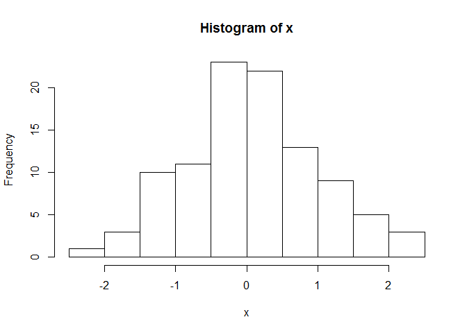
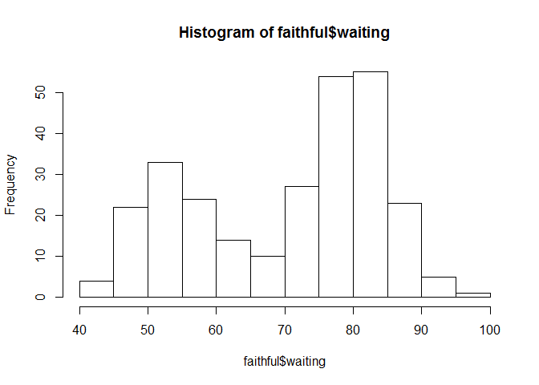
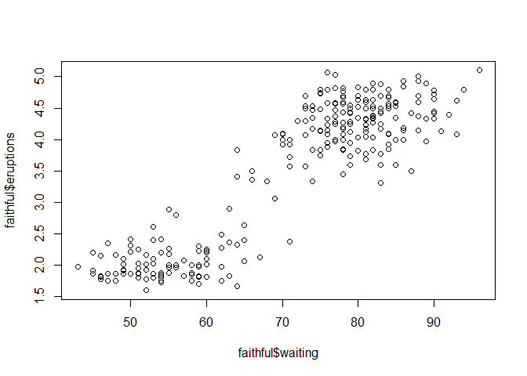
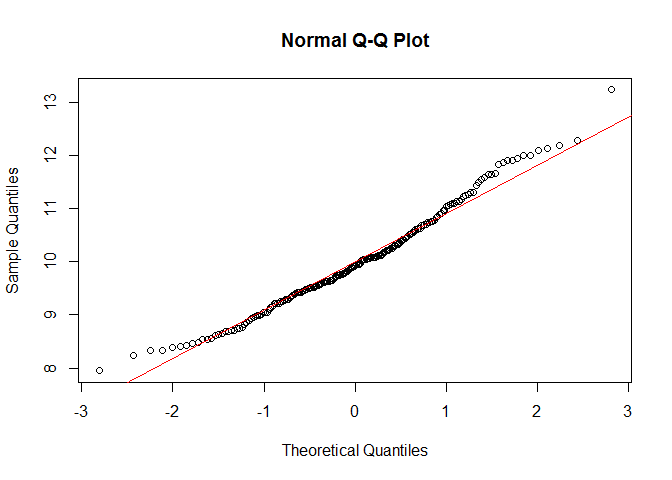
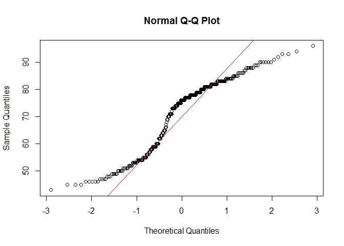
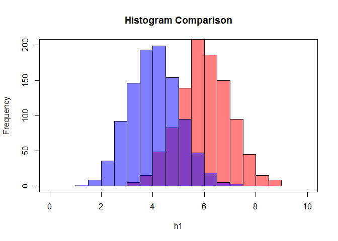
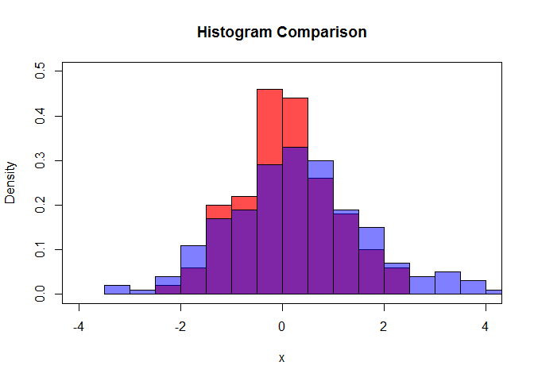

# Problem Set 2 - Statistics

The purpose of this problem set is to explore some descriptive statistics concepts with R.

Try executing code chunk by clicking the *Run* button within the chunk or by placing your cursor inside it and pressing *Ctrl+Shift+Enter*. 

### Generate a Normal Distribution

R has a number of built-in functions to help you create datasets for testing. For example, you could generate a set of data that represents a Gaussian distribution, sometimes called a "Normal" curve. We generate a set of 100 with a mean of 0 and a standard deviation of 1. Then we plot it as a histogram.


```r
# setup working directory

setwd("~/GitHub/DataScienceCurriculum/DataScienceCurriculum")
set.seed(123)
x = rnorm(n=100, mean = 0, sd = 1)
hist(x,breaks=12)
```

<!-- -->

The theoretical probability of points lying within 1 standard deviation of the mean is 0.67. 

### How many points are there within 1 standard deviation of the mean 0? Does that agree with the expected probability?


```r
count1sigma = length(which((x < 1) & (x > -1)))
count1sigma                     
```

```
## [1] 69
```

### Add a Gaussian curve to the histogram
Use the plot, curve, and abline functions to add the normal curve, mean, median, and standard deviations to the plot. Include a legend in the plot.


```r
mu = mean(x)
sigma = sd(x)
med = median(x)
hist(x,breaks=15, main="Gaussian Curve over Histogram",prob=T)
curve(dnorm(x, mean=mu, sd=sigma), 
          col="darkblue", lwd=2, add=TRUE, yaxt="n")
abline(v = mu,
 col = "royalblue",
 lwd = 2)

abline(v = med,
 col = "red",
 lwd = 2)
sdupper = mu + sigma
sdlower = mu - sigma
abline(v = sdupper,
 col = "green",
 lwd = 1)

abline(v = sdlower,
 col = "green",
 lwd = 1)
legend(x = "topright", # location of legend within plot area
 c("Mean", "Median","Std Deviation"),
 col = c("royalblue", "red", "green"),
 lwd = c(2, 2, 2))
```

<!-- -->

### Explore the Old Faithful dataset

There is a built-in dataset in R called "faithful". Explore some of its properties.

#### What is the dimension of the dataset?


```r
dim (faithful)
```

```
## [1] 272   2
```

#### What are the two columns? What is the mean of each column?

Remember that the summary function is an object. Try using the [] operator to extract the mean.


```r
summary(faithful)[4,]
```

```
##         eruptions           waiting 
## "Mean   :3.488  "  "Mean   :70.9  "
```

#### Plot the waiting time. Does the histogram look Gaussian?


```r
hist(faithful$waiting)
```

<!-- -->


#### Plot waiting on the x axis and eruptions (in minutes) on the y axis. What do you observe?


```r
plot (faithful$waiting, faithful$eruptions)
```

<!-- -->


#### Do you think there is a relationship between erruptions and waiting time? 

Why or why not? 

What do you think the relationship might be? 

Could the relationship be explored with a linear model?

#### Could your observations help build a better model for predicting eruption times when you have already waited for 68 minutes?

How would build a subset to test this?

#### Try the Q-Q plotting functions, qqnorm and qqline, to examine the distribution of waiting.

Notice how closely the points fall to the theoretical line.

Here is some sample code to generate the Q-Q plot. Do the same with the faithful$waiting variable.


```r
y = rnorm(n=200, mean = 10, sd = 1)
qqnorm(y); qqline(y, col = 2)
```

<!-- -->

```r
# your qqnorm/qqline goes here
qqnorm(faithful$waiting); qqline(faithful$w, col = 2)
```

<!-- -->


#### What does this plot show about the waiting data? Does it look normal?

### Explore a new sample dataset and compare it to our original, existing dataset.

To do this, use the read.csv function to download our data. Here is the code that will read the dataset.


```r
set.seed(456)
test = rnorm(n=200,mean = 0.3, sd = 1.4)
write.csv (data.frame(test),file="testSample.csv",row.names = F)

library(RCurl)
```

```
## Loading required package: bitops
```

```r
#testSampleUrl = getURL("https://raw.githubusercontent.com/wjholst/DataScienceCurric#ulum/master/testSample.csv")
#testSample = read.csv(text = testSampleUrl)
testSample = read.csv("testSample.csv")
```

The testSample data contains one variable, test. Find the mean and standard deviation of the testSample data. 


```r
summary(testSample)
```

```
##       test        
##  Min.   :-2.9497  
##  1st Qu.:-0.6821  
##  Median : 0.2478  
##  Mean   : 0.3027  
##  3rd Qu.: 1.4359  
##  Max.   : 3.4920
```

```r
sd (testSample$test)
```

```
## [1] 1.387864
```


Do you think it is the same as our previous dataset x? 

Why or why not?

#### Plot the two datasets on the same histogram. 
Here is some sample code to help you do this. Use this code as a template to compare our x dataset to the testSample dataset. Note: to make the histograms appear the same, do not use the frequency on the y axis.


```r
#Random numbers
h2 = rnorm(1000,4)
h1 = rnorm(1000,6)


# Histogram Colored (blue and red)
hist(h1, col=rgb(1,0,0,0.5),xlim=c(0,10), ylim=c(0,200), main = "Histogram Comparison")
hist(h2, col=rgb(0,0,1,0.5), add=T)
box()
```

<!-- -->


```r
#Your code here

hist(x, col=rgb(1,0,0,0.7),xlim=c(-4,4), ylim=c(0,0.5),freq = F,breaks = 15, main = "Histogram Comparison")
hist(testSample$test, col=rgb(0,0,1,0.5),breaks = 15 ,freq = F, add = T)
box()
```

<!-- -->


Does that help you confirm your observation? 


Do you think there might be a more rigorous method to determine if sample means are equal?


## Conclusion

When you save the notebook, an HTML file containing the code and output will be saved alongside it (click the *Preview* button or press *Ctrl+Shift+K* to preview the HTML file). Also, a complete document will be saved with a .rd extension. 
